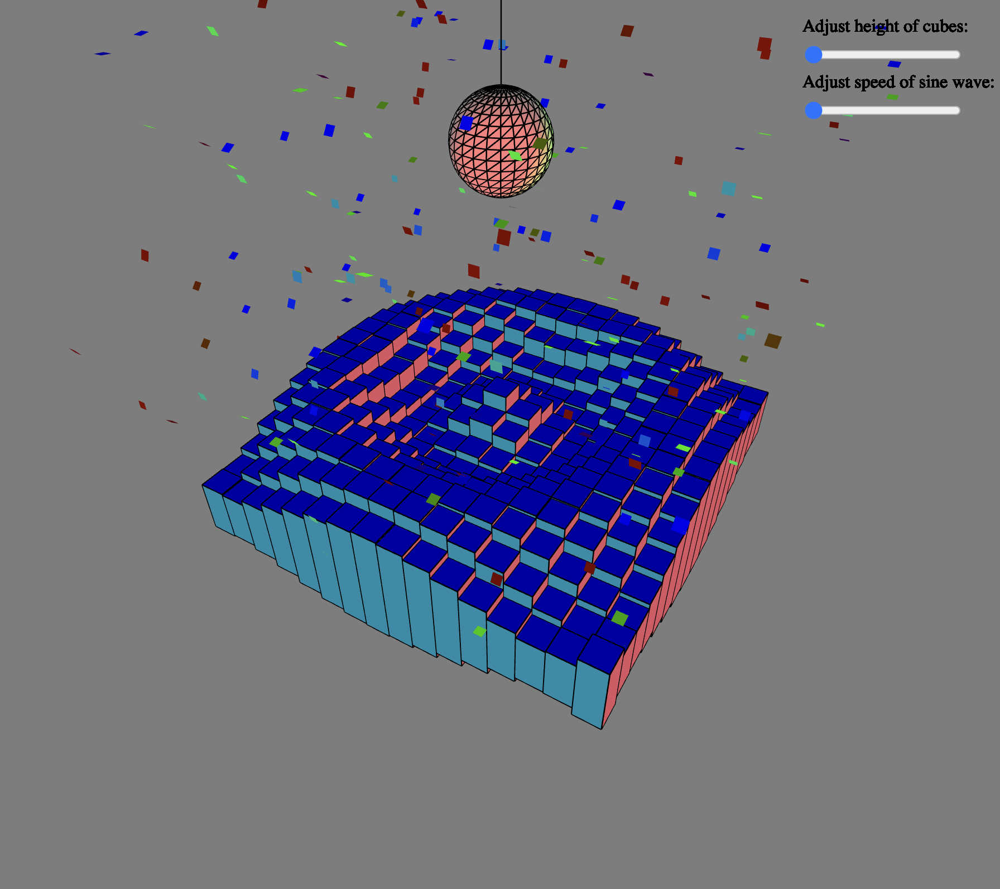

# 3D Sin Games

## About

This application is a dynamic dance floor created using the p5.js library. The floor is made up of a grid of cubes with varying heights, creating a wave-like animation. The maximum height of the cubes and speed of the sine wave can be adjusted using the sliders. The central disco ball is reflects various colourful point lights, creating a realistic effect. Confetti pieces fall from the top of the scene, rotating and resetting once they reach the bottom.
